# Nash Chat API

Backend for a multi-tenant platform that lets anyone build, configure, and deploy custom AI chat
agents — persona, guardrails, knowledge base, and a choice of LLM provider — then publish them to a
web client or WhatsApp through a generated API key.

**Python 3.12 · FastAPI · SQLAlchemy 2.0 (async) · PostgreSQL · Redis · Celery**

| | |
|---|---|
| API surface | 71 paths / 94 operations across 13 tags |
| Schema | 18 domain tables, 16 migrations |
| Error catalogue | 87 stable machine-readable codes |
| Test suite | 807 tests against a real Postgres |

---

## Table of contents

- [What this is](#what-this-is)
- [Architecture](#architecture)
  - [System context](#system-context)
  - [Module layout](#module-layout)
  - [Layering rules](#layering-rules)
  - [Request lifecycle](#request-lifecycle)
- [Data model](#data-model)
- [Core concepts](#core-concepts)
  - [Tenancy and isolation](#tenancy-and-isolation)
  - [Agents and versioning](#agents-and-versioning)
  - [Knowledge bases and retrieval](#knowledge-bases-and-retrieval)
  - [Conversations and the turn](#conversations-and-the-turn)
  - [Tools — live API calls](#tools--live-api-calls)
  - [Channels](#channels)
  - [Authentication](#authentication)
- [API reference](#api-reference)
- [API conventions](#api-conventions)
- [Configuration](#configuration)
- [Getting started](#getting-started)
- [Testing](#testing)
- [Deployment](#deployment)
- [Operations](#operations)
- [Security model](#security-model)
- [Contributing](#contributing)

---

## What this is

A tenant signs up, configures an agent (persona, engagement rules, guardrails, LLM provider and
model), gives it knowledge to answer from, tests it in a preview chat, publishes it, and receives an
API key plus generated integration docs to wire it into their own product or a WhatsApp Business
number.

Three decisions shape almost everything else in the codebase. They are worth reading before the
rest:

> **1 — v1 has no vector/embedding pipeline.**
> Knowledge reaches the model in one of two ways: the extracted text is injected whole into the
> prompt (Tier 1), or Postgres `tsvector` full-text search selects the relevant parts (Tier 2).
> There is no chunking, no embeddings, no pgvector, and no `kb_chunk` table. Knowledge is stored as
> plain extracted text plus source metadata on `kb_source.extracted_text`, which is precisely what
> makes adding a vector tier later an additive change rather than a migration.

> **2 — Tenant isolation is enforced at the query layer, not the application layer.**
> Every read of agents, knowledge, and conversations filters by `tenant_id` **in the query itself**,
> via the shared repository base. No module can query across tenants by accident. A leak here is
> the project's worst failure mode.

> **3 — Retrieved and ingested content is data, never instructions.**
> Full documents are injected raw in v1, so knowledge-base content and user messages are clearly
> delimited from the system prompt. A document that says "ignore your instructions" is quoted text,
> not a directive.

---

## Architecture

### System context

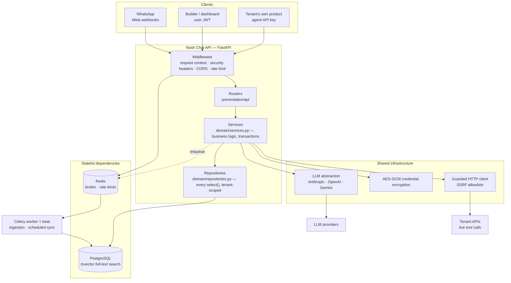

### Module layout

The structural reference is [`kudzaiprichard/aura_api`](https://github.com/kudzaiprichard/aura_api).
Its `configs` / `core` / `shared` packages are adopted as-is. One deliberate difference: `aura_api`
organises feature code **layer-first**; this project is **module-first** — each feature module
carries its own layers.

```
src/
├── configs/               # application.yaml (source of truth) + loader + generated type stub
├── core/                  # wiring only — no business logic
│   ├── factory.py         #   app factory, router registration
│   ├── lifespan.py        #   engine + redis client, admin bootstrap
│   ├── middleware.py      #   request id, logging, timing
│   ├── security_headers.py#   CSP (docs only), HSTS, nosniff, frame-ancestors
│   ├── rate_limit.py      #   memory | redis backends
│   ├── queue.py           #   celery app; inline | redis modes
│   ├── sse.py             #   server-sent events for streaming chat
│   ├── openapi.py         #   TAGS_METADATA, API description
│   └── error_catalogue.py #   87 stable error codes → human text
├── shared/                # infrastructure, no feature logic
│   ├── database/          #   BaseModel (UUID id, timestamps), TenantScopedModel, session
│   ├── responses/         #   ApiResponse / PaginatedResponse, create_router()
│   ├── exceptions/        #   AppException hierarchy + global handlers
│   ├── llm/               #   one interface, three provider adapters, retry, pricing
│   ├── crypto/            #   AES-GCM encryption for tenant credentials at rest
│   ├── net/               #   HTTP client with SSRF guards
│   └── observability/     #   counters and histograms
└── modules/<name>/
    ├── domain/            #   models.py · repositories.py · services.py
    ├── internal/          #   module-private helpers (tasks, prompt assembly, locking)
    └── presentation/      #   dtos/ (Pydantic, camelCase aliases) + api/ (thin routers)
```

Twelve modules: `admin`, `agents`, `analytics`, `api_keys`, `auth`, `channels` (with `web` and
`whatsapp` sub-modules), `conversations`, `knowledge_base`, `system`, `tenants`, `tools`.

### Layering rules

These are review-blocking, and `tests/architecture/test_layering.py` enforces them mechanically —
a repository that commits, a query outside a repository, a cross-module `internal/` import, or an
endpoint that skips the response envelope fails there rather than in review.

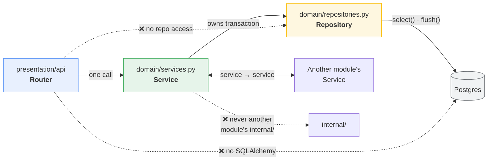

| Rule | Why |
|---|---|
| Routers are thin: parse → one service call → wrap | Keeps HTTP concerns out of business logic |
| Services own business logic **and transaction boundaries** | One place decides what is atomic |
| Repositories own every `select(...)` and call `flush()`, **never** `commit()` | The session dependency commits, so a service can compose several repository calls in one transaction |
| Every model inherits `BaseModel` | UUID `id`, `created_at`, `updated_at` everywhere |
| `internal/` is module-private | Cross-module access is **service → service**, never into another module's repositories or models |
| Every endpoint returns `ApiResponse` / `PaginatedResponse` | Serialised `by_alias=True, exclude_none=True` |
| Raise `AppException` subclasses | Global handlers convert them; no stack trace reaches a client |
| Read config through `src.configs`, never `os.environ` | Enforced by a ruff banned-api rule |
| Tenant scoping lives in the shared repository base | No module can query across tenants by accident |

### Request lifecycle

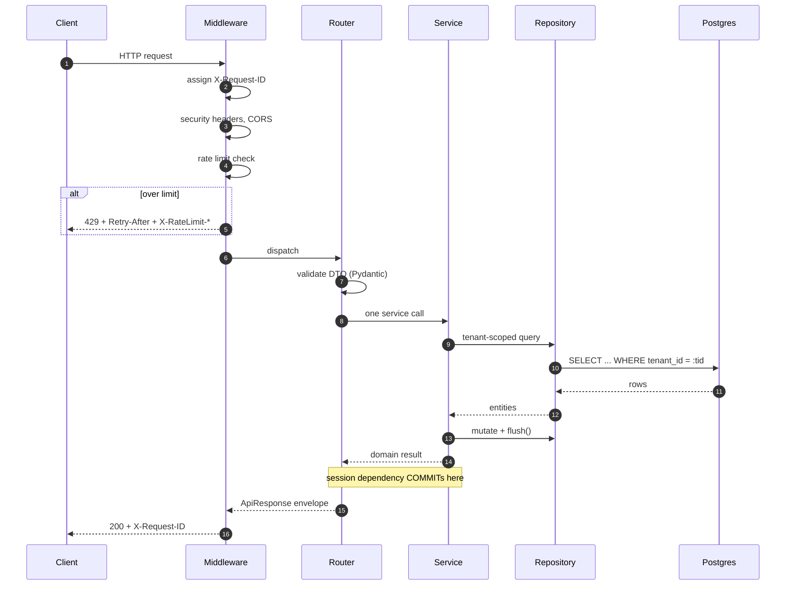

---

## Data model

Twelve of the eighteen domain tables carry `tenant_id` and are reached only through the
tenant-scoped repository base. `agent_kb_link` is the many-to-many join that lets one knowledge base
serve any number of agents.

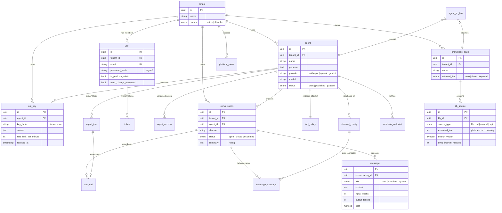

---

## Core concepts

### Tenancy and isolation

A **tenant** is an organisation; a **user** belongs to exactly one. The tenant is always resolved
from the access token, never from a request body or query parameter, so the `/me`, `/tenant`, and
every feature endpoint can only ever touch the caller's own organisation.

Platform administrators are the one exception: they hold `is_platform_admin` and may send
`X-Tenant-Id: <id>` on ordinary endpoints to act inside another account. The `/admin` routes
themselves deliberately hold **no tenant content** — they cover the account directory, the totals,
and the enable/disable lever only.

Disabling an account is immediate and reversible, and deletes nothing: nobody in it can sign in,
its API keys are refused, and its agents answer on no channel.

### Agents and versioning

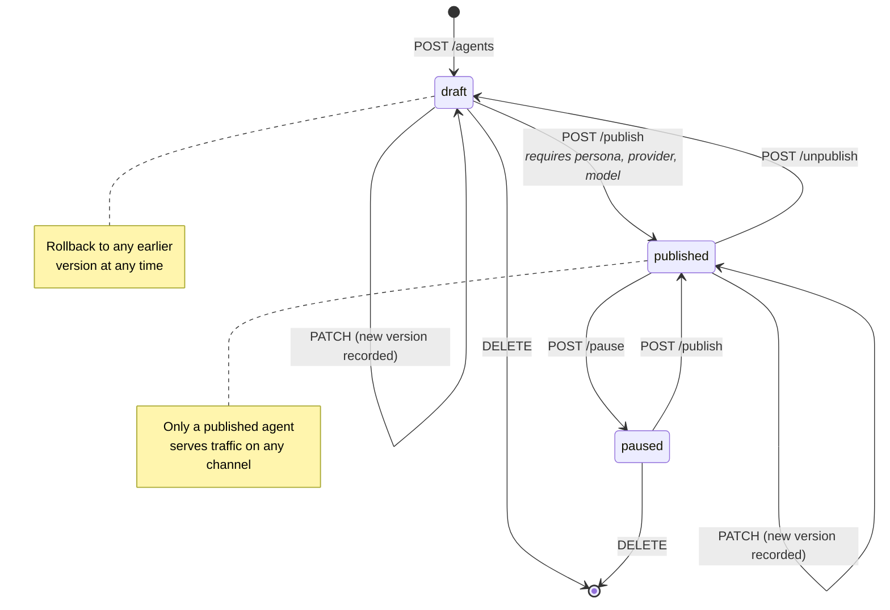

Every configuration change writes an `agent_version` row, so `/agents/{id}/versions` is a full audit
trail and `/versions/{version}/rollback` restores any earlier configuration.

### Knowledge bases and retrieval

A knowledge base holds **sources**. Each source is stored as the plain text extracted from it, plus
metadata — you can read back exactly what an agent will use via
`GET /knowledge-bases/{kb_id}/sources/{source_id}`.

Ingestion leans on native LLM file reading rather than an OCR pipeline:

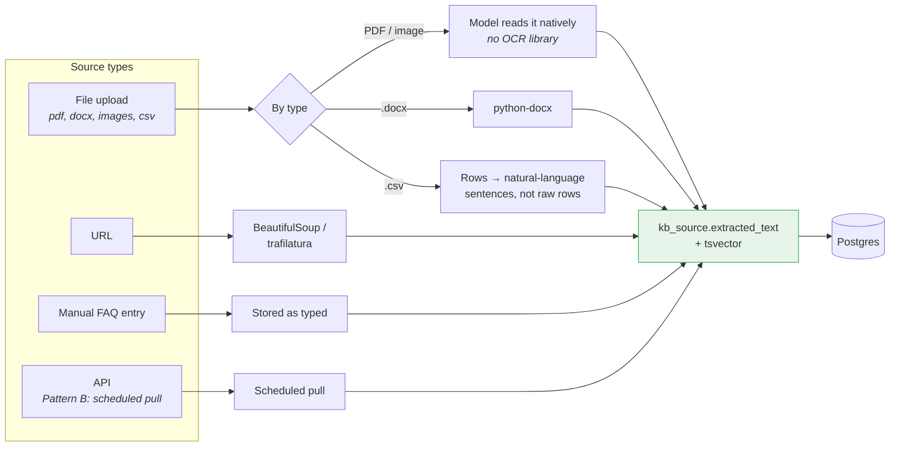

Retrieval picks a tier **per query**:

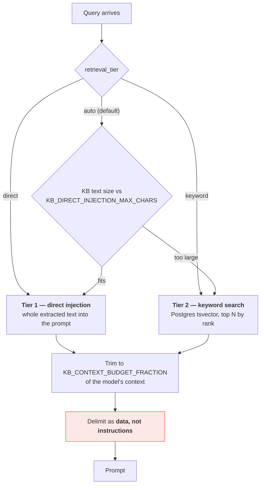

`auto` is the default and the tier most tenants should stay on: a knowledge base that grows past
what can be injected starts being searched instead, with no configuration change. A `vector` tier is
deliberately **absent** from the enum rather than present-and-inert — adding the value before the
pipeline exists would let a tenant select a tier that silently does nothing.

`POST /knowledge-bases/retrieval/explain` shows exactly what a given query would retrieve and why.

### Conversations and the turn

A turn is the unit of work. It is serialised per conversation (see
`conversations/internal/locking.py`) so two concurrent messages cannot interleave history.

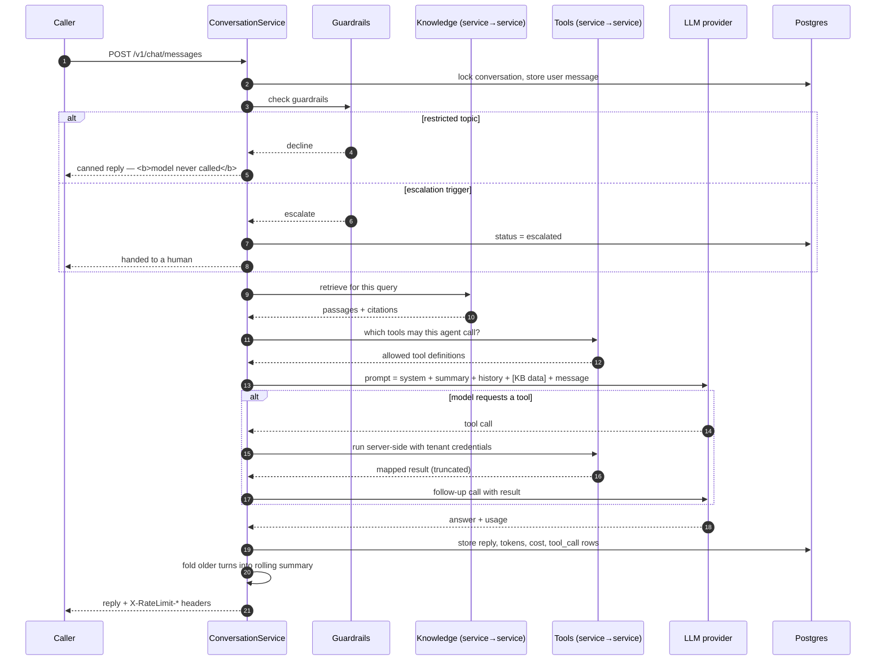

Notes that matter:

- **Guardrails run before the model.** A restricted topic is settled locally; paying a provider to
  decline something already decided would be waste.
- **Streaming and tools are mutually exclusive per turn.** A stream cannot pause mid-token to make
  an HTTP call and resume, so an agent with tools takes the buffered path and delivers its finished
  answer as one chunk. The caller cannot tell the difference.
- **Usage is summed across every provider call the turn made.** A tool-using turn calls the model at
  least twice, and the tenant pays for both.
- **A partial stream is still stored.** Bytes already sent cannot be un-sent, so a mid-stream failure
  is reported in band and the partial text is kept — a half answer in the transcript is more use to
  whoever investigates than a gap.

### Tools — live API calls

Two distinct API-as-knowledge patterns exist, and an agent can use both at once:

| | Pattern A — live tool calling | Pattern B — scheduled pull |
|---|---|---|
| When | At query time, mid-turn | On a schedule |
| Path | `tools` module | Normal ingestion path |
| Model's role | Decides when to call, from the tool description | None |
| Credentials | Injected server-side, never seen by the model | Stored on the source |
| Bound | Per-agent endpoint allowlist (`tool_policy`) | URL fetch guards |

A customer waits on every Pattern A call, so the timeout is short (`TOOLS_TIMEOUT_SECONDS=8`) and
the retry budget is one. Every call is logged to `tool_call` with arguments, latency and outcome,
readable at `GET /tools/{tool_id}/calls`. `POST /tools/{tool_id}/try` runs one with your own
arguments for debugging.

The allowlist is an **SSRF control**, not a convenience: a tool endpoint is called with
model-written arguments, so `TOOLS_ALLOW_PRIVATE_URLS` must stay `false` outside local development.

### Channels

Channels use a channel-agnostic internal message format, so Telegram or Messenger can be added
without touching the conversation engine.

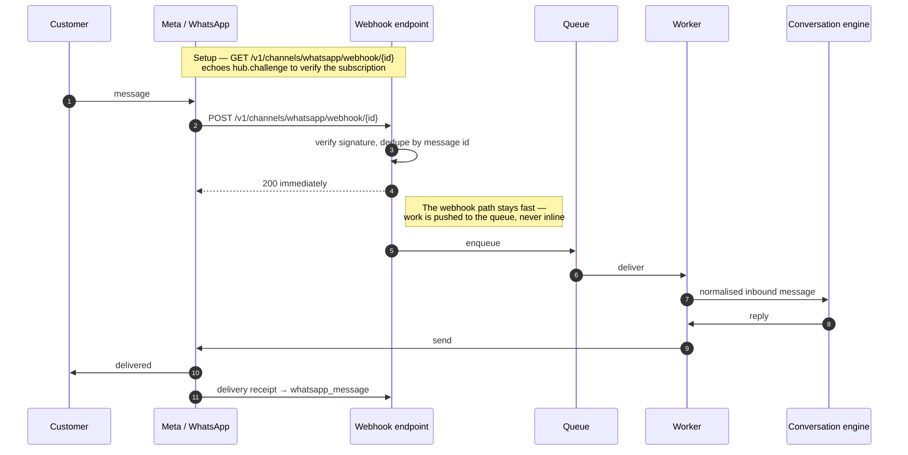

The **24-hour customer service window** is the easiest thing to get wrong: outside it, only a
pre-approved template message is deliverable. `GET /agents/{id}/channels/whatsapp/sessions/{contact_id}`
reports where a contact stands.

`WHATSAPP_PUBLIC_BASE_URL` must be the origin Meta can actually reach. Behind a proxy the request's
own origin is the internal one, and a tenant pasting that into Meta gets a callback that never
verifies.

### Authentication

Two credential types, for two different audiences:

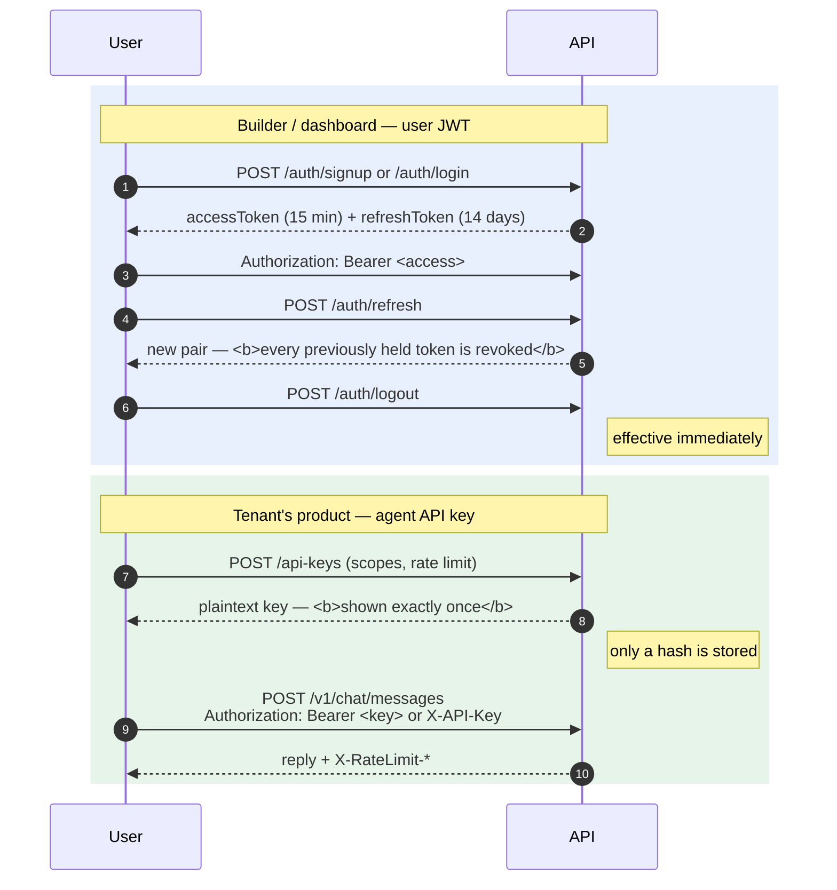

Passwords are hashed with **argon2**. A key is issued for one agent, carries explicit scopes and its
own rate limit, and revocation takes effect on the next request.

---

## API reference

Interactive docs are generated from the code and are a deliverable, not a by-product — spec §5.6
generates each tenant's integration guide from the OpenAPI schema.

| | |
|---|---|
| Swagger UI | <http://127.0.0.1:8000/docs> |
| ReDoc | <http://127.0.0.1:8000/redoc> |
| OpenAPI schema | <http://127.0.0.1:8000/openapi.json> |

Paths and availability are configurable (`DOCS_ENABLED`, `DOCS_SWAGGER_PATH`, `DOCS_REDOC_PATH`,
`DOCS_OPENAPI_PATH`). **An endpoint is not finished until it is documented**: every route carries a
tag, a `summary`, a `description`, an explicit `ApiResponse[...]` response model, and a `responses`
entry per meaningful failure. `tests/test_openapi.py::test_every_route_is_documented` fails CI on
any route missing a tag or summary.

The schema declares two security schemes, `HTTPBearer` and `ApiKey`. Across the 94 operations: 82
require a user JWT, 4 require an agent API key, and 8 declare none.

Auth column:

| | Meaning |
|---|---|
| 🔑 | User JWT — `Authorization: Bearer <accessToken>` |
| 🎫 | Agent API key — `Authorization: Bearer <key>` or `X-API-Key` |
| 🛡️ | User JWT that must **also** carry the platform-admin flag |
| 🎚️ | No scheme; gated by the `OBSERVABILITY_OPERATOR_TOKEN` header |
| ⬜ | Public — no credential |

### `system` — health and readiness

| | Method | Path | Description |
|---|---|---|---|
| ⬜ | `GET` | `/health` | Liveness. Touches no dependency, so it stays green while Postgres or Redis are down. |
| ⬜ | `GET` | `/health/ready` | Readiness. `SELECT 1` on Postgres and `PING` on Redis; **503** naming any dependency that is down. |

### `auth` — accounts and sessions

| | Method | Path | Description |
|---|---|---|---|
| ⬜ | `POST` | `/auth/signup` | Create an account and its tenant |
| ⬜ | `POST` | `/auth/login` | Sign in; returns an access + refresh pair |
| ⬜ | `POST` | `/auth/refresh` | Rotate the token pair; revokes every token held previously |
| 🔑 | `POST` | `/auth/logout` | Sign out; effective immediately |
| 🔑 | `POST` | `/auth/password` | Change your password |

### `account` — the signed-in user and tenant

| | Method | Path | Description |
|---|---|---|---|
| 🔑 | `GET` | `/me` | Get the signed-in account |
| 🔑 | `PATCH` | `/me` | Update the signed-in profile |
| 🔑 | `GET` | `/tenant` | Get the current tenant |
| 🔑 | `PATCH` | `/tenant` | Rename the current tenant |
| 🔑 | `GET` | `/tenant/members` | List members of the current tenant |

### `agents` — configuration and lifecycle

| | Method | Path | Description |
|---|---|---|---|
| 🔑 | `GET` | `/agents` | List agents |
| 🔑 | `POST` | `/agents` | Create an agent |
| 🔑 | `GET` | `/agents/{agent_id}` | Get an agent |
| 🔑 | `PATCH` | `/agents/{agent_id}` | Update configuration (records a version) |
| 🔑 | `DELETE` | `/agents/{agent_id}` | Delete an agent |
| 🔑 | `POST` | `/agents/{agent_id}/publish` | Publish — requires persona, provider, model |
| 🔑 | `POST` | `/agents/{agent_id}/unpublish` | Return to draft |
| 🔑 | `POST` | `/agents/{agent_id}/pause` | Pause a published agent |
| 🔑 | `GET` | `/agents/{agent_id}/versions` | List configuration versions |
| 🔑 | `GET` | `/agents/{agent_id}/versions/{version}` | Get one version |
| 🔑 | `POST` | `/agents/{agent_id}/versions/{version}/rollback` | Roll back to an earlier version |

### `knowledge-bases` — knowledge and sources

| | Method | Path | Description |
|---|---|---|---|
| 🔑 | `GET` | `/knowledge-bases` | List knowledge bases |
| 🔑 | `POST` | `/knowledge-bases` | Create a knowledge base |
| 🔑 | `GET` | `/knowledge-bases/usage` | Storage usage against the tenant quota |
| 🔑 | `POST` | `/knowledge-bases/retrieval/explain` | Explain what an agent would retrieve |
| 🔑 | `GET` | `/knowledge-bases/{kb_id}` | Get a knowledge base |
| 🔑 | `PATCH` | `/knowledge-bases/{kb_id}` | Update (name, retrieval tier) |
| 🔑 | `DELETE` | `/knowledge-bases/{kb_id}` | Delete a knowledge base |
| 🔑 | `POST` | `/knowledge-bases/{kb_id}/retrieval/explain` | Explain what this KB would retrieve |
| 🔑 | `GET` | `/knowledge-bases/{kb_id}/agents` | List agents using it |
| 🔑 | `PUT` | `/knowledge-bases/{kb_id}/agents/{agent_id}` | Attach to an agent |
| 🔑 | `DELETE` | `/knowledge-bases/{kb_id}/agents/{agent_id}` | Detach from an agent |
| 🔑 | `GET` | `/knowledge-bases/{kb_id}/sources` | List sources |
| 🔑 | `POST` | `/knowledge-bases/{kb_id}/sources/file` | Upload a file (extraction runs immediately) |
| 🔑 | `POST` | `/knowledge-bases/{kb_id}/sources/url` | Add a web page |
| 🔑 | `POST` | `/knowledge-bases/{kb_id}/sources/manual` | Add a manual FAQ entry |
| 🔑 | `POST` | `/knowledge-bases/{kb_id}/sources/api` | Add an API as a source (Pattern B) |
| 🔑 | `GET` | `/knowledge-bases/{kb_id}/sources/{source_id}` | Get a source **and its extracted text** |
| 🔑 | `DELETE` | `/knowledge-bases/{kb_id}/sources/{source_id}` | Delete a source |
| 🔑 | `PUT` | `/knowledge-bases/{kb_id}/sources/{source_id}/schedule` | Set a sync schedule |
| 🔑 | `POST` | `/knowledge-bases/{kb_id}/sources/{source_id}/sync` | Re-sync now |

### `conversations` — the record, and the builder's test chat

| | Method | Path | Description |
|---|---|---|---|
| 🔑 | `GET` | `/conversations` | List conversations |
| 🔑 | `POST` | `/conversations/messages` | Send a message to an agent (preview) |
| 🔑 | `GET` | `/conversations/{conversation_id}` | Get a conversation |
| 🔑 | `GET` | `/conversations/{conversation_id}/messages` | Get the transcript |
| 🔑 | `POST` | `/conversations/{conversation_id}/close` | Close a conversation |
| 🔑 | `POST` | `/conversations/{conversation_id}/escalate` | Hand to a human (idempotent) |

### `chat` — **the public API**

The only surface a tenant's own product talks to. Authenticated by an **agent API key**, not a user
token. Every response carries the key's remaining rate-limit allowance.

| | Method | Path | Description |
|---|---|---|---|
| 🎫 | `POST` | `/v1/chat/messages` | Send a message and get the agent's reply |
| 🎫 | `POST` | `/v1/chat/messages/stream` | Send a message and stream the reply (SSE) |
| 🎫 | `GET` | `/v1/chat/session` | Look up the open conversation for a user |
| 🎫 | `GET` | `/v1/chat/conversations/{conversation_id}/messages` | Fetch history |

### `api-keys` — integration credentials

| | Method | Path | Description |
|---|---|---|---|
| 🔑 | `GET` | `/api-keys` | List API keys |
| 🔑 | `POST` | `/api-keys` | Issue a key — **plaintext shown exactly once** |
| 🔑 | `GET` | `/api-keys/{key_id}` | Get a key's metadata |
| 🔑 | `PATCH` | `/api-keys/{key_id}` | Update scopes, rate limit, expiry |
| 🔑 | `POST` | `/api-keys/{key_id}/revoke` | Revoke — effective on the next request |

### `channels` — reachability and integration

| | Method | Path | Description |
|---|---|---|---|
| 🔑 | `GET` | `/agents/{agent_id}/channels` | List an agent's channel configurations |
| 🔑 | `PUT` | `/agents/{agent_id}/channels/{channel_type}` | Configure a channel |
| 🔑 | `GET` | `/agents/{agent_id}/integration-docs` | Generated integration guide |
| 🔑 | `GET` | `/webhooks` | List outbound webhook endpoints |
| 🔑 | `POST` | `/webhooks` | Create a webhook endpoint |
| 🔑 | `PATCH` | `/webhooks/{webhook_id}` | Update a webhook endpoint |
| 🔑 | `DELETE` | `/webhooks/{webhook_id}` | Delete a webhook endpoint |
| 🔑 | `POST` | `/webhooks/{webhook_id}/test` | Send a test delivery |

### `whatsapp`

| | Method | Path | Description |
|---|---|---|---|
| 🔑 | `PUT` | `/agents/{agent_id}/channels/whatsapp` | Connect to a WhatsApp number |
| 🔑 | `GET` | `/agents/{agent_id}/channels/whatsapp` | Get the connection |
| 🔑 | `DELETE` | `/agents/{agent_id}/channels/whatsapp` | Disconnect |
| 🔑 | `POST` | `/agents/{agent_id}/channels/whatsapp/messages` | Send a message to a contact |
| 🔑 | `GET` | `/agents/{agent_id}/channels/whatsapp/messages` | List messages and delivery status |
| 🔑 | `GET` | `/agents/{agent_id}/channels/whatsapp/sessions/{contact_id}` | Check the 24-hour window |
| ⬜ | `GET` | `/v1/channels/whatsapp/webhook/{connection_id}` | Verify the subscription (Meta) |
| ⬜ | `POST` | `/v1/channels/whatsapp/webhook/{connection_id}` | Receive messages and receipts (Meta, signed) |

### `tools` — live API calls

| | Method | Path | Description |
|---|---|---|---|
| 🔑 | `GET` | `/agents/{agent_id}/tools` | List an agent's tools |
| 🔑 | `POST` | `/agents/{agent_id}/tools` | Add a live API tool |
| 🔑 | `GET` | `/agents/{agent_id}/tools/policy` | Get the endpoint allowlist |
| 🔑 | `PUT` | `/agents/{agent_id}/tools/policy` | Set the endpoint allowlist |
| 🔑 | `GET` | `/tools/{tool_id}` | Get a tool |
| 🔑 | `PATCH` | `/tools/{tool_id}` | Update a tool |
| 🔑 | `DELETE` | `/tools/{tool_id}` | Delete a tool |
| 🔑 | `GET` | `/tools/{tool_id}/calls` | Read the call log |
| 🔑 | `POST` | `/tools/{tool_id}/try` | Run with your own arguments |

### `analytics` — read-only

Numbers come straight from the stored rows, so a total here reconciles with the transcript it was
counted from. Preview traffic from the builder's test chat is excluded by default.

| | Method | Path | Description |
|---|---|---|---|
| 🔑 | `GET` | `/analytics/usage` | Usage, cost and quality for the whole tenant |
| 🔑 | `GET` | `/analytics/failures` | Everything that failed |
| 🔑 | `GET` | `/analytics/conversations/{conversation_id}/trace` | A conversation with its citation trace |
| 🔑 | `GET` | `/agents/{agent_id}/analytics` | One agent's dashboard |
| 🎚️ | `GET` | `/analytics/operations` | This process's counters across every tenant. Declares no security scheme — it is opened by the `OBSERVABILITY_OPERATOR_TOKEN` header and is **closed entirely when no token is configured**. |

### `admin` — platform staff only

| | Method | Path | Description |
|---|---|---|---|
| 🛡️ | `GET` | `/admin/overview` | Platform totals |
| 🛡️ | `GET` | `/admin/tenants` | List accounts |
| 🛡️ | `GET` | `/admin/tenants/{tenant_id}` | Read one account |
| 🛡️ | `PUT` | `/admin/tenants/{tenant_id}/status` | Enable or disable an account |
| 🛡️ | `DELETE` | `/admin/tenants/{tenant_id}` | Delete an account permanently |
| 🛡️ | `GET` | `/admin/accounts/by-email` | Find the account behind an email address |

---

## API conventions

### Response envelope

Every endpoint returns the same shape, with **camelCase** keys. `value` and `error` are mutually
exclusive, and null fields are omitted (`by_alias=True, exclude_none=True`).

```json
{ "success": true, "value": { }, "message": null }
```

Errors carry a stable `error.code` alongside human-readable `error.detail`:

```json
{
  "success": false,
  "error": { "code": "AGENT_NAME_TAKEN", "detail": "Another agent in your tenant has that name." }
}
```

There are **87 codes** in `src/core/error_catalogue.py`. Match on `code`, never on `detail` — the
prose may change, the code will not. A sample:

| Code | Meaning |
|---|---|
| `INVALID_CREDENTIALS` | The email or password is wrong. Never says which. |
| `INVALID_TOKEN` | Malformed, expired, or signed by something else. |
| `PASSWORD_CHANGE_REQUIRED` | The bootstrap admin must change its password first. |
| `MISSING_API_KEY` | The public chat API needs an agent key. |
| `INVALID_API_KEY` | Does not exist, revoked, or expired — all read alike. |
| `INSUFFICIENT_SCOPE` | Valid key, but not issued with the scope this route needs. |
| `ACCOUNT_DISABLED` | Nobody in the account can sign in and no agent serves. |
| `AGENT_NAME_TAKEN` / `KB_NAME_TAKEN` / `TOOL_NAME_TAKEN` | Uniqueness within the tenant. |
| `METRICS_DISABLED` | No operator token configured, so operator metrics are closed. |

### Request tracing

Every response carries an `X-Request-ID`. Send your own to have it echoed back, and quote it when
reporting a problem.

### Rate limits

Responses under a limit carry `X-RateLimit-Limit`, `X-RateLimit-Remaining` and `X-RateLimit-Reset`;
a `429` adds `Retry-After`.

- The public chat API is limited **per API key** (each key carries its own limit).
- Sign-up, sign-in and refresh are limited **per client address** — the endpoints reachable with no
  credential.

Use the `redis` backend anywhere with more than one worker: a limit counted per process is not the
limit that was sold.

---

## Configuration

`src/configs/application.yaml` is the source of truth for shape and defaults. Every value is written
as `"${ENV_VAR:default} | type"`, and an environment variable — or a key in a local `.env`, which
the loader reads itself — overrides the default.

```python
from src.configs import DATABASE_URL, SERVER_PORT   # ✅
import os; os.environ["DATABASE_URL"]               # ❌ banned by a ruff rule
```

After adding or renaming a key, regenerate the type stub and commit it:

```bash
python -m src.configs.generate
```

Sections: `app`, `server`, `database`, `redis`, `llm`, `conversations`, `knowledge_base`, `auth`,
`queue`, `sync`, `tools`, `analytics`, `observability`, `admin`, `security`, `rate_limit`,
`webhooks`, `whatsapp`, `docs`, `logging`, `cors`.

### Settings that bite

| Key | Default | Why it matters |
|---|---|---|
| `SECURITY_ENCRYPTION_KEY` | *empty* | Encrypts tenant credentials (WhatsApp tokens, tool keys, webhook secrets) at rest with AES-GCM. **Set it before the first credential is stored** — rows written under a key cannot be read without it. Empty stores them in clear and warns at startup. Local dev and the test suite deliberately run unencrypted. |
| `JWT_SECRET_KEY` | `CHANGE_ME` | Must be a long random value in any deployed environment. |
| `QUEUE_MODE` | `inline` | `redis` is the real one — work leaves the request. `inline` runs it in the request instead; fine locally, wrong anywhere real. |
| `RATE_LIMIT_BACKEND` | `memory` | Use `redis` with more than one worker. |
| `KB_ALLOW_PRIVATE_URLS` | `false` | Leave false anywhere reachable from outside: it is what stops a submitted URL reaching internal services (SSRF). |
| `TOOLS_ALLOW_PRIVATE_URLS` | `false` | Same, and worse — a tool endpoint is called with model-written arguments. |
| `WHATSAPP_PUBLIC_BASE_URL` | *empty* | Must be the origin Meta can reach. Empty uses the request's own origin, which is correct locally and wrong behind a proxy. |
| `LLM_PRICE_TABLE` | *empty* | Per-model USD per million tokens, e.g. `gpt-4o=2.5/10,claude-sonnet-4-5=3/15`. Empty records tokens but not cost — **the platform never guesses at pricing**. |
| `LLM_FALLBACK_PROVIDER` | *empty* | Provider to use when the configured one is rate limited or down. Empty disables fallback. |
| `OBSERVABILITY_OPERATOR_TOKEN` | *empty* | Opens `GET /analytics/operations`. Empty leaves it closed. |
| `DATABASE_TEST_URL` | — | **The suite drops and recreates this database on every run.** Never point it at the app database. |

---

## Getting started

### Prerequisites

Python 3.12, PostgreSQL, and Redis. The pinned toolchain (`.python-version`, Dockerfile, CI, mypy,
ruff) all targets 3.12 — running a different interpreter is the usual source of "works on my
machine". `requirements.txt` is a full freeze of exact versions, so a different minor version will
fail to install: several pins are wheel-only packages (`psycopg-binary`, `greenlet`, `lxml`) with no
wheel built for another interpreter. `.python-version` is what pins the deploy host, which would
otherwise use its provider's default.

### Local setup

```bash
python -m venv .venv
.venv\Scripts\activate            # Windows;  source .venv/bin/activate on macOS/Linux
pip install -r requirements.txt

cp .env.example .env              # then set DATABASE_URL and DATABASE_TEST_URL
git config core.hooksPath .githooks

alembic upgrade head
python main.py
```

The API listens on `http://127.0.0.1:8000`.

Prefer containers for the dependencies:

```bash
docker compose up -d postgres redis     # just the backing services
docker compose --profile full up        # also builds and runs the API, worker and beat
```

### Background workers

`QUEUE_MODE=inline` needs no worker. With `QUEUE_MODE=redis`:

```bash
celery -A worker.celery_app worker --loglevel=info --pool=solo
celery -A worker.celery_app beat --loglevel=info      # exactly one, ever
```

> Two beat processes means every due source is enqueued twice.

### The first administrator

Set both values before the first boot and the account is created at startup, once:

```bash
ADMIN_BOOTSTRAP_EMAIL=admin@example.com
ADMIN_BOOTSTRAP_PASSWORD=change-me-on-first-login   # at least 12 characters
```

That password is a **handover, not a credential** — it sits in a file everyone with deploy access
can read — so the account is created having to change it. It can sign in and call
`POST /auth/password`; every other endpoint answers `403 PASSWORD_CHANGE_REQUIRED` until it has, and
the API warns on every boot while that is still true. Nothing is reset by a restart: if the address
already exists, the bootstrap does nothing.

Granting or revoking the flag for an existing account:

```bash
python scripts/grant_platform_admin.py ada@example.com   # --revoke | --list
```

### Migrations

```bash
alembic upgrade head                              # apply
alembic downgrade -1                              # step back one
alembic revision --autogenerate -m "what changed" # new revision
```

---

## Testing

All four must be green before a PR:

```bash
ruff check .
ruff format --check .
mypy
pytest
```

`pytest` runs against a **real Postgres**: it creates and migrates its own database
(`DATABASE_TEST_URL`) and rolls each test back in a transaction, so it never touches development
data. Redis is not required — the tests that cover it use stubs.

Two suites are worth knowing about:

- `tests/architecture/test_layering.py` enforces the layering rules mechanically. Repositories that
  commit, queries outside repositories, cross-module `internal/` imports and endpoints that skip the
  response envelope fail here rather than in review.
- `tests/test_openapi.py::test_every_route_is_documented` fails on any route missing a tag or
  summary. Treat it as the floor, not the goal.

```bash
pip-audit -r requirements.txt      # dependency audit; CI runs it on every PR
```

---

## Deployment

```bash
cp .env.example .env.production    # DATABASE_URL, REDIS_URL, JWT_SECRET_KEY,
                                   # SECURITY_ENCRYPTION_KEY, provider keys, CORS origins
docker compose -f docker-compose.prod.yml --env-file .env.production up -d
```

`scripts/entrypoint.sh` runs `alembic upgrade head` before the API serves its first request, so a
deploy migrates itself. The worker and scheduler roles do **not** migrate — exactly one role should.

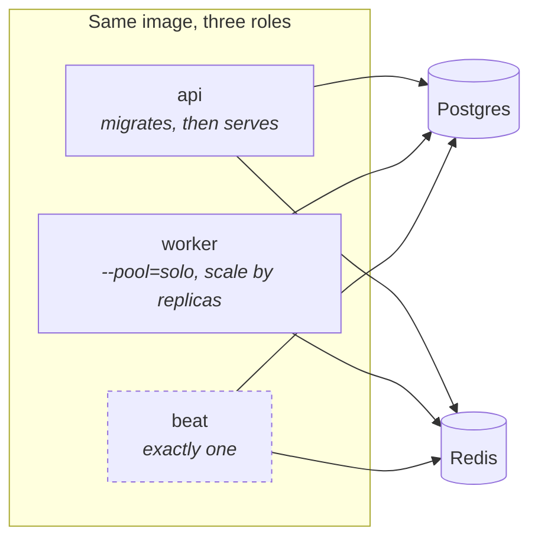

Extraction is I/O bound — a provider call or an HTTP fetch — so concurrency comes from running more
worker containers rather than more processes inside one, and `--pool=solo` behaves the same on every
platform.

---

## Operations

- **`.docs/RUNBOOK.md`** — provider outage, queue backlog, webhook storm, and the rest.
- **`.docs/V1_ACCEPTANCE.md`** — every §10 success criterion with the test or check that proves it.
- **`GET /health/ready`** — gate traffic on this, not `/health`.
- **`GET /analytics/operations`** — request and provider counters for this process.
- **`python scripts/smoke_load.py --url … --key …`** — load smoke test on the chat path.

Two paths are deliberately kept fast by pushing work to the queue rather than doing it inline:
**webhook delivery** and **ingestion**. If either starts doing real work in-request, that is the
regression to look for.

---

## Security model

| Control | Where |
|---|---|
| Tenant isolation | Query layer, via the shared repository base — not application checks |
| Password hashing | argon2 |
| Credential encryption at rest | AES-GCM (`SECURITY_ENCRYPTION_KEY`) for WhatsApp tokens, tool API keys, webhook signing secrets |
| API keys | Hashed; plaintext shown exactly once; per-key scopes and rate limit |
| SSRF | Endpoint allowlist per agent for tools; URL fetch guards for KB; `*_ALLOW_PRIVATE_URLS` default false |
| Prompt injection | Retrieved and ingested content is delimited as **data, never instructions** |
| Webhook authenticity | Signature verification plus idempotency by message id |
| Response headers | `nosniff`, `X-Frame-Options: DENY`, `frame-ancestors 'none'`, COOP/CORP, HSTS over HTTPS |
| CSP | Sent on the documentation paths only — the sole HTML this service serves. API responses get none. |
| Error responses | `AppException` subclasses only; no stack trace reaches a client |

> **On the docs CSP.** `script-src` carries `'unsafe-inline'` because FastAPI's Swagger template
> bootstraps itself from an inline `<script>` calling `SwaggerUIBundle({...})`. Without it the
> browser loads the bundle and then blocks the one call that would use it, and `/docs` renders
> blank. The concession is confined to the documentation policy; those pages are static generated
> HTML carrying no tenant content.

---

## Contributing

`main` is protected: no direct pushes. Branch → PR → green CI → code-owner approval → squash-merge →
delete the branch. Only complete, working slices land on `main`; if a change needs plumbing before
its user-facing surface exists, land the inert plumbing first and keep the unfinished surface
unreachable until it works.

```bash
git switch main && git pull origin main
git switch -c feat/short-description
# ...work, verify, commit...
git push -u origin feat/short-description
gh pr create --base main --fill
```

Commit messages — the `commit-msg` hook rejects anything else:

```
type(scope): short summary of what was done
- path/to/file.py: what changed in this file
- path/to/other.py: what changed in this file
```

Conventional-commit type (`feat`, `fix`, `refactor`, `chore`, `style`, `docs`, `test`, `ci`), scope
is the module or domain. **Exactly one bullet per file in the commit.**

See `CONTRIBUTING.md` for the full workflow, `CLAUDE.md` for the layering rules, and
`.docs/IMPLEMENTATION_PLAN.md` for the build order.
